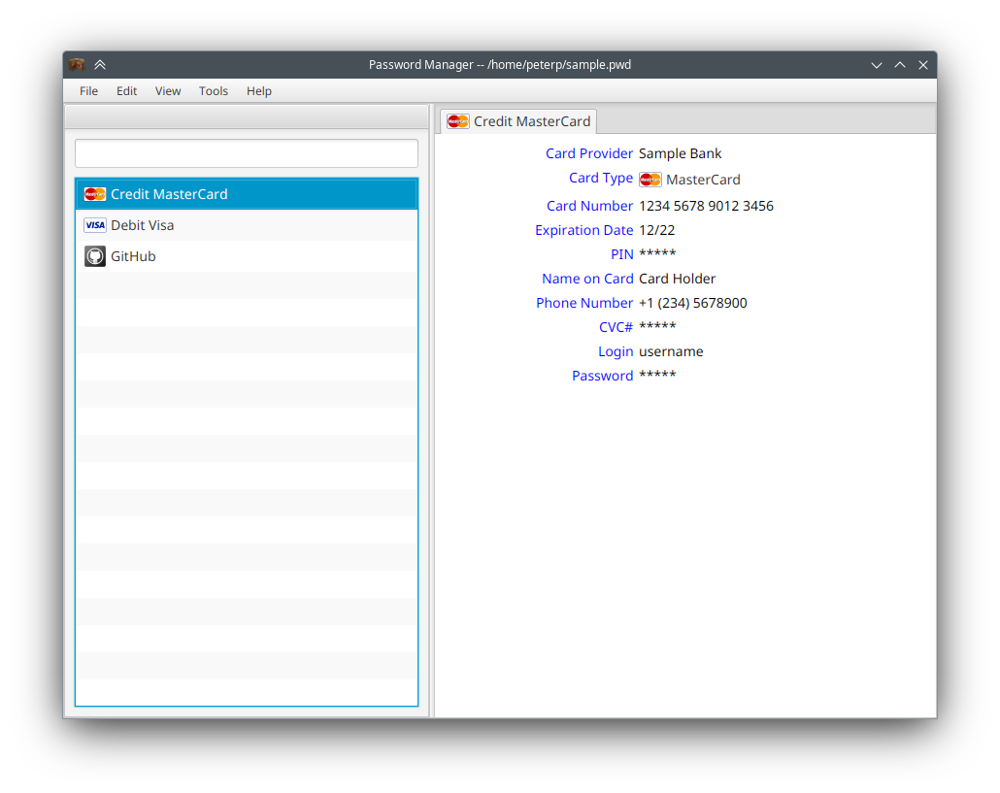

# Password Manager

[](https://jdk.java.net/archive/)
[](LICENSE)

Desktop application to store passwords, credit card numbers and other sensitive information. 
Application uses 256-bit AES encryption.



## Security Considerations

Application enforces security via file encryption only. Application makes no effort to counter-attacks targeted 
to user account, operating system or hardware including RAM.

## Build

* Set ```JAVA_HOME``` to JDK 22+.
* Execute:

```shell script
./mvnw clean verify
```

Application JAR and all dependencies will be placed in ```target/jmods```.

## Run

```shell script
./mvnw javafx:run
```

To open specific file add ```-Dpassword.file=<file>``` to the command line.

## Binary Packages

To build binary installers perform the following steps:
* On Microsoft Windows: install [WiX Toolset 3.x](https://github.com/wixtoolset/wix3/releases), add its binary 
directory to ```PATH``` environment variable
* Execute:

```shell script
./mvnw clean verify jpackage:jpackage
```

Installation packages will be found in ```target/dist``` directory.

## Support

There is no support for this application.
